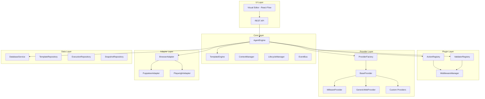

# Browser Automation Engine - Implementation Plan

## Project Overview

**Goal**: Refactor the existing `browser-automation-engine` into a modular, platform-agnostic automation framework with visual flow editing capabilities similar to n8n.

**Source**: `browser-automation-engine/`
**Target**: `refactor_automation_engine/`

---

## Architecture Summary



---

## Phase 1: Core Foundation

### 1.1 Project Structure Setup

Create the complete directory structure:

```
refactor_automation_engine/
├── index.js                    # Main entry point
├── config.js                   # Configuration loader
├── package.json                # Dependencies
├── .env.example                # Environment template
│
├── core/                       # Core Engine
│   ├── AgentEngine.js          # Main orchestrator
│   ├── TemplateEngine.js       # Template processing
│   ├── ContextManager.js       # Variable and state management
│   ├── LifecycleManager.js     # Execution lifecycle
│   └── EventBus.js             # Event pub/sub system
│
├── adapters/                   # Browser Adapters
│   ├── BrowserAdapter.js       # Base adapter interface
│   └── puppeteer/
│       ├── PuppeteerAdapter.js
│       └── PuppeteerPage.js
│
├── actions/                    # Action System
│   ├── BaseAction.js
│   ├── ActionRegistry.js
│   ├── MiddlewareManager.js
│   └── builtin/
│       ├── navigation/
│       ├── interaction/
│       ├── flow-control/
│       ├── data/
│       └── wait-validate/
│
├── validators/                 # Validator System
│   ├── BaseValidator.js
│   ├── ValidatorRegistry.js
│   └── builtin/
│
├── providers/                  # Provider System
│   ├── BaseProvider.js
│   ├── ProviderFactory.js
│   ├── millware/
│   └── generic/
│
├── database/                   # Persistence
│   ├── DatabaseService.js
│   ├── schema.sql
│   └── repositories/
│
├── api/                        # REST API
│   ├── server.js
│   └── routes/
│
├── web-ui/                     # Visual Editor
│   ├── src/
│   └── package.json
│
├── templates/                  # Template Storage
│   ├── generic/
│   └── providers/
│
├── logs/                       # Execution Logs
│   ├── executions/
│   ├── screenshots/
│   └── state/
│
└── utils/                      # Utilities
    ├── logger.js
    ├── helpers.js
    └── constants.js
```

### 1.2 Core Components Implementation

#### AgentEngine.js
Main orchestrator that coordinates all components:
- Browser lifecycle management
- Template execution
- Error handling and recovery
- Event emission

#### TemplateEngine.js
Template processing and compilation:
- JSON template loading
- Variable substitution
- Node graph traversal
- Edge resolution

#### ContextManager.js
Variable and state management:
- Context scope management
- Variable resolution
- State snapshots

#### EventBus.js
Event pub/sub system:
- Execution events
- Progress reporting
- Error broadcasting

### 1.3 Deliverables

- [ ] Create directory structure
- [ ] Implement AgentEngine with basic execution
- [ ] Implement TemplateEngine with variable substitution
- [ ] Implement ContextManager
- [ ] Implement EventBus
- [ ] Create configuration system
- [ ] Setup logging utilities

---

## Phase 2: Provider System Implementation

### 2.1 Base Provider Interface

```javascript
class BaseProvider {
  // Required methods
  getBaseUrl()
  getLoginWorkflow()
  getSelectors()
  async validateSession(page)
  async handleSessionExpiry(page, context)
  
  // Optional hooks
  async beforeExecution(context)
  async afterExecution(result)
  async beforeAction(action, params, context)
  async afterAction(action, result, context)
}
```

### 2.2 ProviderFactory

Factory pattern for provider instantiation:
- Provider registration
- Provider creation with config
- Provider listing

### 2.3 Built-in Providers

#### MillwareProvider
- Login workflow for Millware HR system
- Session validation
- Error page detection
- Autocomplete handling

#### GenericWebProvider
- Configurable login workflow
- Generic session validation
- Custom selector support

### 2.4 Deliverables

- [ ] Implement BaseProvider interface
- [ ] Implement ProviderFactory
- [ ] Implement MillwareProvider with full functionality
- [ ] Implement GenericWebProvider
- [ ] Create provider documentation
- [ ] Add provider tests

---

## Phase 3: Action System Implementation

### 3.1 BaseAction Class

```javascript
class BaseAction {
  static schema = {
    type: '',
    version: '1.0.0',
    params: {},
    middleware: []
  };
  
  validateParams(params)
  async execute(page, params, context)
  handleError(error, context)
  async beforeExecute(page, params, context)
  async afterExecute(result, page, params, context)
}
```

### 3.2 ActionRegistry

Central registry for all actions:
- Class-based action registration
- Function-based action registration
- Alias support
- Action execution

### 3.3 Built-in Actions

#### Navigation Actions
- NavigateAction
- RefreshAction
- GoBackAction

#### Interaction Actions
- ClickAction
- TypeAction
- SelectAction
- HoverAction
- ScrollAction

#### Flow Control Actions
- ForEachAction
- IfAction
- SwitchAction
- ParallelAction
- TryAction
- WhileAction

#### Data Actions
- ExtractAction
- TransformAction
- FilterAction
- MapAction
- HttpRequestAction
- SetVariableAction

#### Wait/Validate Actions
- WaitAction
- WaitForElementAction
- WaitForConditionAction
- WaitForNavigationAction
- SleepAction

### 3.4 Middleware System

Pre/post execution hooks:
- SessionValidator
- BrowserHealthCheck
- ScreenshotCapture
- StateSnapshot
- RequestLogger

### 3.5 Deliverables

- [ ] Implement BaseAction class
- [ ] Implement ActionRegistry
- [ ] Implement MiddlewareManager
- [ ] Implement all navigation actions
- [ ] Implement all interaction actions
- [ ] Implement all flow control actions
- [ ] Implement all data actions
- [ ] Implement all wait/validate actions
- [ ] Create middleware hooks
- [ ] Add action tests

---

## Phase 4: Validator System Implementation

### 4.1 BaseValidator Class

```javascript
class BaseValidator {
  async validate(page, params, context)
  invalid(reason, details)
  valid(data)
}
```

### 4.2 ValidatorRegistry

Central registry for validators:
- Validator registration
- Chain creation
- Validator execution

### 4.3 Built-in Validators

- ElementValidator - Check element exists/visible/enabled
- ValueValidator - Check element value/text
- ConditionValidator - Evaluate conditions
- NetworkValidator - Check network status
- ChainValidator - Chain multiple validators

### 4.4 Custom Validators

- MillwareSyncValidator - Validate Millware data sync
- FormValidator - Validate form submissions
- Custom validators per provider

### 4.5 Deliverables

- [ ] Implement BaseValidator class
- [ ] Implement ValidatorRegistry
- [ ] Implement ElementValidator
- [ ] Implement ValueValidator
- [ ] Implement ConditionValidator
- [ ] Implement NetworkValidator
- [ ] Implement ChainValidator with AND/OR logic
- [ ] Implement MillwareSyncValidator
- [ ] Add validator tests

---

## Phase 5: Template Engine Implementation

### 5.1 Template Format

Node-based JSON format with edges:

```json
{
  "id": "template-id",
  "name": "Template Name",
  "version": "2.0.0",
  "provider": "millware",
  "variables": {},
  "nodes": [],
  "edges": []
}
```

### 5.2 Template Processing

- Template loading from file/database
- Variable substitution with ${path} syntax
- Node graph traversal
- Edge condition evaluation
- Sub-template includes

### 5.3 Template Validation

- Schema validation
- Node type validation
- Edge connectivity validation
- Variable reference validation

### 5.4 Deliverables

- [ ] Implement template loader
- [ ] Implement variable substitution engine
- [ ] Implement node graph executor
- [ ] Implement edge resolver
- [ ] Implement sub-template includes
- [ ] Implement template validator
- [ ] Create template migration utility
- [ ] Add template tests

---

## Phase 6: Database Persistence Layer

### 6.1 Database Schema

```sql
-- Templates table
CREATE TABLE templates (
  id TEXT PRIMARY KEY,
  name TEXT NOT NULL,
  version TEXT NOT NULL,
  provider TEXT,
  content TEXT NOT NULL,
  metadata TEXT,
  created_at DATETIME DEFAULT CURRENT_TIMESTAMP,
  updated_at DATETIME DEFAULT CURRENT_TIMESTAMP
);

-- Executions table
CREATE TABLE executions (
  id TEXT PRIMARY KEY,
  template_id TEXT,
  status TEXT NOT NULL,
  context TEXT,
  result TEXT,
  started_at DATETIME,
  completed_at DATETIME,
  error TEXT
);

-- Execution steps table
CREATE TABLE execution_steps (
  id TEXT PRIMARY KEY,
  execution_id TEXT NOT NULL,
  node_id TEXT,
  action_type TEXT,
  status TEXT,
  params TEXT,
  result TEXT,
  error TEXT,
  duration_ms INTEGER,
  created_at DATETIME
);

-- State snapshots table
CREATE TABLE state_snapshots (
  id TEXT PRIMARY KEY,
  execution_id TEXT NOT NULL,
  step_index INTEGER,
  state TEXT NOT NULL,
  created_at DATETIME
);

-- Template tags table
CREATE TABLE template_tags (
  template_id TEXT,
  tag TEXT,
  PRIMARY KEY (template_id, tag)
);
```

### 6.2 Repositories

- TemplateRepository - CRUD for templates
- ExecutionRepository - Execution logging
- SnapshotRepository - State recovery

### 6.3 Deliverables

- [ ] Implement DatabaseService with SQLite
- [ ] Implement TemplateRepository
- [ ] Implement ExecutionRepository
- [ ] Implement SnapshotRepository
- [ ] Create database migrations
- [ ] Add database tests

---

## Phase 7: Visual Flow Editor

### 7.1 Technology Stack

- React 18+
- Vite
- React Flow (for flow diagrams)
- Material-UI or Tailwind CSS
- Zustand (state management)

### 7.2 Components

#### FlowEditor
Main canvas with React Flow:
- Drag and drop nodes
- Connect nodes with edges
- Zoom and pan
- MiniMap
- Controls

#### Node Components
- ActionNode - Action execution nodes
- FlowControlNode - If/ForEach/Switch nodes
- ValidationNode - Validation nodes
- DataNode - Data operation nodes
- StartNode/EndNode - Flow boundaries

#### Toolbar
- Node palette with categories
- Search functionality
- Template actions (save, load, export)

#### PropertiesPanel
- Node configuration form
- Parameter inputs
- Validation rules
- Error handling config

### 7.3 Features

- Real-time validation
- Template import/export
- Undo/Redo
- Copy/Paste nodes
- Node search
- Template versioning
- Execution preview

### 7.4 Deliverables

- [ ] Setup React + Vite project
- [ ] Implement FlowEditor with React Flow
- [ ] Implement custom node components
- [ ] Implement Toolbar
- [ ] Implement PropertiesPanel
- [ ] Implement template serialization
- [ ] Connect to backend API
- [ ] Add visual editor tests

---

## Phase 8: Migration & Testing

### 8.1 Template Migration

Migrate existing templates from old format:
- `_attendance_logic.json` → New node-based format
- `_charge_job_input.json` → New format
- `_leave_input.json` → New format
- `input-flow-simple.json` → New format

### 8.2 Migration Utility

Create migration script:
- Parse old template format
- Convert steps to nodes
- Generate edges
- Validate output

### 8.3 Testing Strategy

#### Unit Tests
- Core engine tests
- Action tests
- Validator tests
- Provider tests

#### Integration Tests
- Template execution tests
- Provider integration tests
- Database integration tests

#### End-to-End Tests
- Full automation flow tests
- Visual editor tests
- API tests

### 8.4 Documentation

- API documentation
- User guide
- Developer guide
- Provider development guide
- Action development guide

### 8.5 Deliverables

- [ ] Create template migration utility
- [ ] Migrate all existing templates
- [ ] Write unit tests (80%+ coverage)
- [ ] Write integration tests
- [ ] Write E2E tests
- [ ] Create API documentation
- [ ] Create user guide
- [ ] Create developer guide

---

## Implementation Timeline

| Phase | Description | Priority |
|-------|-------------|----------|
| 1 | Core Foundation | High |
| 2 | Provider System | High |
| 3 | Action System | High |
| 4 | Validator System | Medium |
| 5 | Template Engine | High |
| 6 | Database Persistence | Medium |
| 7 | Visual Flow Editor | Medium |
| 8 | Migration & Testing | High |

---

## Key Design Decisions

### 1. Provider Pattern
**Decision**: Use provider pattern to abstract platform-specific logic.
**Rationale**: Enables the engine to work with ANY platform, not just Millware.

### 2. Hybrid Plugin System
**Decision**: Support both class-based and function-based actions.
**Rationale**: Maximum flexibility for different use cases.

### 3. Node-based Templates
**Decision**: Use node-based JSON format with edges.
**Rationale**: Visualizable as flow diagrams, supports complex flows.

### 4. SQLite Database
**Decision**: Use SQLite for persistence.
**Rationale**: Simple, file-based, no external dependencies.

### 5. React Flow for Visual Editor
**Decision**: Use React Flow library.
**Rationale**: Mature, well-documented, active community.

---

## Success Criteria

1. **Modularity**: Can add new providers without modifying core code
2. **Extensibility**: Can add new actions/validators via plugins
3. **Visual Editing**: Can create/edit templates visually
4. **Backward Compatibility**: Can run existing templates
5. **Performance**: Equal or better performance than old engine
6. **Reliability**: Robust error handling and recovery
7. **Documentation**: Complete and clear documentation

---

## Risk Mitigation

| Risk | Mitigation |
|------|------------|
| Template migration complexity | Create automated migration utility |
| Performance regression | Benchmark against old engine |
| Learning curve for visual editor | Provide templates and tutorials |
| Breaking changes | Maintain backward compatibility layer |

---

## Next Steps

1. Review and approve this implementation plan
2. Begin Phase 1: Core Foundation
3. Iterate through each phase
4. Continuous testing and documentation
