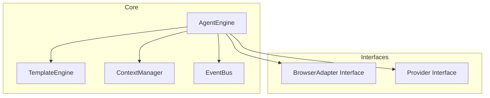

# Phase 1: Core Foundation - Implementation Details

## Overview

Phase 1 focuses on creating the foundational infrastructure for the modular browser automation engine. This phase establishes the core components that all other systems will build upon.

## Target Architecture



---

## Directory Structure

Create the following directory structure:

```
refactor_automation_engine/
├── src/
│   ├── core/
│   │   ├── AgentEngine.ts
│   │   ├── TemplateEngine.ts
│   │   ├── ContextManager.ts
│   │   ├── LifecycleManager.ts
│   │   └── EventBus.ts
│   │
│   ├── adapters/
│   │   ├── BrowserAdapter.ts
│   │   ├── PuppeteerAdapter.ts
│   │   └── index.ts
│   │
│   ├── providers/
│   │   ├── BaseProvider.ts
│   │   ├── ProviderFactory.ts
│   │   ├── millware/
│   │   │   ├── MillwareProvider.ts
│   │   │   └── selectors.json
│   │   └── generic/
│   │       └── GenericWebProvider.ts
│   │
│   ├── actions/
│   │   ├── BaseAction.ts
│   │   ├── ActionRegistry.ts
│   │   └── builtin/
│   │       ├── navigation/
│   │       ├── interaction/
│   │       ├── flow-control/
│   │       └── data/
│   │
│   ├── validators/
│   │   ├── BaseValidator.ts
│   │   ├── ValidatorRegistry.ts
│   │   └── builtin/
│   │
│   ├── database/
│   │   ├── DatabaseService.ts
│   │   └── repositories/
│   │
│   ├── templates/
│   │   ├── TemplateLoader.ts
│   │   └── compiler/
│   │
│   ├── types/
│   │   ├── node.types.ts
│   │   ├── edge.types.ts
│   │   └── template.types.ts
│   │
│   ├── utils/
│   │   ├── logger.ts
│   │   ├── config.ts
│   │   └── helpers.ts
│   │
│   └── index.ts
│
├── templates/
│   ├── millware/
│   │   ├── login.json
│   │   ├── attendance-input.json
│   │   └── leave-input.json
│   └── generic/
│       └── basic-flow.json
│
├── database/
│   ├── schema.sql
│   └── migrations/
│
├── api/
│   ├── server.ts
│   └── routes/
│
├── web-ui/
│   ├── src/
│   └── package.json
│
└── tests/
    ├── unit/
    └── integration/
```

---

## Implementation Tasks

### Task 1.1: Core - AgentEngine

**File**: `src/core/AgentEngine.ts`

```typescript
interface AgentEngineConfig {
  provider: BaseProvider;
  browserAdapter?: BrowserAdapter;
  headless?: boolean;
  slowMo?: number;
  screenshot?: boolean;
  logLevel?: 'debug' | 'info' | 'warn' | 'error';
}

class AgentEngine {
  private provider: BaseProvider;
  private browserAdapter: BrowserAdapter;
  private templateEngine: TemplateEngine;
  private actionRegistry: ActionRegistry;
  private validatorRegistry: ValidatorRegistry;
  private contextManager: ContextManager;
  private eventBus: EventBus;
  private isRunning: boolean = false;
  private isPaused: boolean = false;

  constructor(config: AgentEngineConfig);
  
  // Lifecycle methods
  async initialize(): Promise<void>;
  async runTemplate(templateId: string, context: Record<string, any>): Promise<ExecutionResult>;
  async runTemplateByContent(templateContent: Template, context: Record<string, any>): Promise<ExecutionResult>;
  async pause(): void;
  async resume(): void;
  async stop(): void;
  
  // Event handling
  on(event: string, handler: EventHandler): void;
  off(event: string, handler: EventHandler): void;
  
  // State
  getState(): AgentState;
}

enum ExecutionStatus {
  PENDING = 'pending',
  RUNNING = 'running',
  PAUSED = 'paused',
  COMPLETED = 'completed',
  FAILED = 'failed'
}

interface ExecutionResult {
  status: ExecutionStatus;
  context: Record<string, any>;
  steps: StepResult[];
  error?: Error;
  duration: number;
}
```

**Responsibilities**:
- Orchestrates all components
- Manages browser lifecycle
- Executes templates
- Emits events
- Handles errors and recovery

### Task 1.2: Core - TemplateEngine

**File**: `src/core/TemplateEngine.ts`

```typescript
interface TemplateEngineConfig {
  actionRegistry: ActionRegistry;
  validatorRegistry: ValidatorRegistry;
  provider: BaseProvider;
}

class TemplateEngine {
  constructor(config: TemplateEngineConfig);
  
  // Template processing
  compile(template: Template): CompiledTemplate;
  validate(template: Template): ValidationResult;
  
  // Execution
  async execute(
    compiledTemplate: CompiledTemplate,
    context: ContextManager,
    options?: ExecutionOptions
  ): Promise<ExecutionResult>;
  
  // Node execution
  async executeNode(
    node: Node,
    context: ContextManager
  ): Promise<NodeResult>;
  
  // Edge resolution
  resolveNextNode(
    currentNode: Node,
    result: NodeResult,
    edges: Edge[]
  ): Node | null;
}

interface CompiledTemplate {
  id: string;
  name: string;
  version: string;
  nodes: Map<string, Node>;
  edges: Edge[];
  entryNode: Node;
  variables: Record<string, any>;
}
```

**Responsibilities**:
- Parses and compiles templates
- Validates template structure
- Executes nodes in order
- Resolves edges based on conditions
- Manages node execution flow

### Task 1.3: Core - ContextManager

**File**: `src/core/ContextManager.ts`

```typescript
interface ContextScope {
  id: string;
  parent?: ContextScope;
  variables: Record<string, any>;
  timestamp: number;
}

class ContextManager {
  constructor();
  
  // Scope management
  createScope(parentScope?: ContextScope): ContextScope;
  pushScope(scope: ContextScope): void;
  popScope(): ContextScope;
  
  // Variable access
  set(key: string, value: any, scope?: ContextScope): void;
  get(path: string, defaultValue?: any): any;
  has(path: string): boolean;
  delete(key: string): boolean;
  
  // Snapshot
  snapshot(): ContextSnapshot;
  restore(snapshot: ContextSnapshot): void;
  
  // Utility
  clone(): Record<string, any>;
  merge(data: Record<string, any>): void;
}

// Variable substitution with ${path} syntax
class VariableResolver {
  static resolve(template: string, context: Record<string, any>): string;
  static resolveObject<T>(obj: T, context: Record<string, any>): T;
}
```

**Responsibilities**:
- Manages variable scopes
- Provides variable access API
- Handles variable substitution
- Creates state snapshots

### Task 1.4: Core - EventBus

**File**: `src/core/EventBus.ts`

```typescript
type EventHandler = (event: Event) => void | Promise<void>;

interface Event {
  type: string;
  timestamp: number;
  data?: any;
}

class EventBus {
  constructor();
  
  // Subscribe
  on(eventType: string, handler: EventHandler): void;
  once(eventType: string, handler: EventHandler): void;
  
  // Unsubscribe
  off(eventType: string, handler: EventHandler): void;
  
  // Emit
  emit(eventType: string, data?: any): void;
  emitAsync(eventType: string, data?: any): Promise<void>;
  
  // Utility
  removeAllListeners(eventType?: string): void;
  listenerCount(eventType: string): number;
}

// Predefined events
const Events = {
  TEMPLATE_START: 'template:start',
  TEMPLATE_COMPLETE: 'template:complete',
  TEMPLATE_ERROR: 'template:error',
  NODE_START: 'node:start',
  NODE_COMPLETE: 'node:complete',
  NODE_ERROR: 'node:error',
  VALIDATION_START: 'validation:start',
  VALIDATION_COMPLETE: 'validation:complete',
  VALIDATION_ERROR: 'validation:error',
  BROWSER_LAUNCH: 'browser:launch',
  BROWSER_CLOSE: 'browser:close',
  PROGRESS: 'execution:progress'
} as const;
```

**Responsibilities**:
- Event publication and subscription
- Asynchronous event handling
- Event history

---

## Type Definitions

### Task 1.5: Types

**File**: `src/types/template.types.ts`

```typescript
// Template Structure
interface Template {
  id: string;
  name: string;
  version: string;
  description?: string;
  provider?: string;
  providerConfig?: Record<string, any>;
  metadata?: TemplateMetadata;
  variables?: Record<string, any>;
  nodes: Node[];
  edges: Edge[];
}

interface TemplateMetadata {
  author?: string;
  createdAt?: string;
  updatedAt?: string;
  tags?: string[];
  estimatedDuration?: string;
  category?: string;
}

// Node Types
type NodeType = 'action' | 'flowControl' | 'validation' | 'data' | 'start' | 'end';

interface Node {
  id: string;
  type: NodeType;
  actionType: string;
  position?: Position;
  data: NodeData;
  onError?: ErrorHandler;
}

interface Position {
  x: number;
  y: number;
}

interface NodeData {
  // Action parameters
  [key: string]: any;
}

interface ErrorHandler {
  action: 'retry' | 'fallback' | 'fail' | 'ignore';
  maxRetries?: number;
  retryDelay?: number;
  backoffMultiplier?: number;
  fallbackTo?: string;
  onError?: ErrorHandler;
}

// Edge Types
interface Edge {
  id: string;
  from: string;
  to: string;
  condition?: string;
  label?: string;
}
```

---

## Configuration System

### Task 1.6: Config

**File**: `src/utils/config.ts`

```typescript
interface Config {
  // Browser options
  browser: {
    headless: boolean;
    slowMo: number;
    userDataDir?: string;
    args?: string[];
  };
  
  // Engine options
  engine: {
    screenshotOnError: boolean;
    screenshotDir: string;
    logLevel: 'debug' | 'info' | 'warn' | 'error';
    defaultTimeout: number;
    maxRetries: number;
  };
  
  // Database options
  database: {
    type: 'sqlite' | 'postgres' | 'mysql';
    path?: string;
    host?: string;
    port?: number;
    database: string;
    username?: string;
    password?: string;
  };
  
  // API options
  api: {
    port: number;
    host: string;
  };
}

class ConfigLoader {
  static load(path?: string): Config;
  static loadFromEnv(): Partial<Config>;
  static validate(config: Config): boolean;
}
```

---

## Logging System

### Task 1.7: Logger

**File**: `src/utils/logger.ts`

```typescript
type LogLevel = 'debug' | 'info' | 'warn' | 'error';

interface LogEntry {
  level: LogLevel;
  message: string;
  timestamp: number;
  context?: Record<string, any>;
  error?: Error;
}

class Logger {
  constructor(context: string, level?: LogLevel);
  
  debug(message: string, context?: Record<string, any>): void;
  info(message: string, context?: Record<string, any>): void;
  warn(message: string, context?: Record<string, any>): void;
  error(message: string, error?: Error, context?: Record<string, any>): void;
  
  setLevel(level: LogLevel): void;
  child(context: Record<string, any>): Logger;
}

// Pre-configured loggers
const logger = {
  core: new Logger('core'),
  adapter: new Logger('adapter'),
  provider: new Logger('provider'),
  action: new Logger('action'),
  validator: new Logger('validator'),
  api: new Logger('api')
};
```

---

## Browser Adapter Interface

### Task 1.8: Browser Adapter

**File**: `src/adapters/BrowserAdapter.ts`

```typescript
interface BrowserAdapter {
  // Lifecycle
  launch(): Promise<void>;
  close(): Promise<void>;
  reconnect(): Promise<boolean>;
  
  // Page operations
  navigate(url: string, options?: NavigationOptions): Promise<void>;
  goBack(): Promise<void>;
  goForward(): Promise<void>;
  reload(): Promise<void>;
  
  // Element operations
  click(selector: string, options?: ClickOptions): Promise<void>;
  type(selector: string, value: string, options?: TypeOptions): Promise<void>;
  select(selector: string, value: string): Promise<void>;
  evaluate<T>(fn: Function, ...args: any[]): Promise<T>;
  
  // Wait operations
  waitForSelector(selector: string, options?: WaitOptions): Promise<void>;
  waitForFunction(fn: Function, options?: WaitOptions): Promise<void>;
  waitForNavigation(options?: NavigationOptions): Promise<void>;
  
  // Data extraction
  extract(selector: string): Promise<string>;
  extractAll(selector: string): Promise<string[]>;
  
  // Screenshot
  screenshot(options?: ScreenshotOptions): Promise<Buffer>;
  
  // State
  isConnected(): boolean;
  getUrl(): string;
  getTitle(): string;
}
```

---

## Implementation Order

1. **Types First** - Define all type interfaces
2. **Logger** - Create logging utility
3. **Config** - Create configuration system
4. **EventBus** - Simple event system
5. **ContextManager** - Variable management
6. **BrowserAdapter** - Define interface
7. **PuppeteerAdapter** - Implement Puppeteer
8. **BaseProvider** - Provider interface
9. **ProviderFactory** - Factory pattern
10. **TemplateEngine** - Core execution
11. **AgentEngine** - Main orchestrator

---

## Success Criteria

- [ ] All core components compile without errors
- [ ] TypeScript types are properly defined
- [ ] Logger outputs correctly at all levels
- [ ] Config loads from file and environment
- [ ] EventBus handles events correctly
- [ ] ContextManager manages scopes properly
- [ ] BrowserAdapter launches Puppeteer
- [ ] TemplateEngine executes simple template
- [ ] AgentEngine orchestrates full flow

---

## Testing Strategy

### Unit Tests
- Config loading
- Variable substitution
- Context scopes
- Event emission
- Node edge resolution

### Integration Tests
- Full template execution
- Browser lifecycle
- Provider integration
- Error handling
