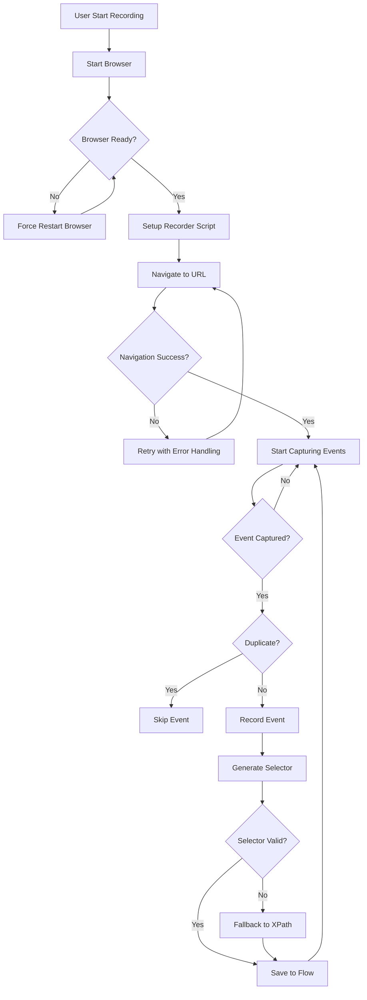

# Plan Perbaikan Recording & Playback Automation Engine

## 📋 Analisis Masalah

Berdasarkan analisis codebase, saya mengidentifikasi 4 masalah utama:

### 1. Browser Tidak Terbuka / about:blank
**Gejala:**
- Browser tidak terbuka saat rerun
- Jika terbuka, yang muncul adalah `about:blank`
- Tidak sampai ke URL tujuan

**Akar Masalah:**
- [`Engine.ts:79-138`](backend/src/engine/Engine.ts:79) - `startBrowser()` memiliki race condition saat menggunakan browser yang sudah ada
- [`Engine.ts:191-270`](backend/src/engine/Engine.ts:191) - `startRecording()` memanggil navigasi sebelum halaman siap
- [`Engine.ts:229-246`](backend/src/engine/Engine.ts:229) - `framenavigated` event menangkap `about:blank` saat inisialisasi

### 2. Navigasi Gagal
**Gejala:**
- Saat rerun, tidak sampai ke URL yang dituju
- Error SSL atau network error tidak ditangani dengan baik

**Akar Masalah:**
- [`Engine.ts:166-189`](backend/src/engine/Engine.ts:166) - `tryNavigate()` hanya menangkap `ERR_SSL_PROTOCOL_ERROR`, error lain tidak ditangani
- [`implementations.ts:5-48`](backend/src/engine/actions/implementations.ts:5) - navigasi action tidak memiliki retry logic

### 3. Duplikasi Event
**Gejala:**
- Recording menghasilkan event yang sama beberapa kali
- Click tercatat beberapa kali untuk satu aksi

**Akar Masalah:**
- [`recorder.ts`](backend/src/engine/recorder.ts) - tidak ada deduplication logic
- Tidak ada timestamp-based debouncing untuk mencegah rapid duplicate events

### 4. Gagal Capture dengan Tepat
**Gejala:**
- Selector yang dihasilkan tidak akurat
- Event tidak tercatat dengan benar

**Akar Masalah:**
- [`recorder.ts:31-81`](backend/src/engine/recorder.ts:31) - `getSelector()` tidak cukup robust untuk semua kasus
- [`recorder.ts:207`](backend/src/engine/recorder.ts:207) - `evaluateOnNewDocument` tidak bekerja dengan baik untuk SPA

---

## 🔧 Rencana Perbaikan

### Phase 1: Perbaikan Browser Management

#### 1.1 Fix `startBrowser()` - Engine.ts
```typescript
// Masalah: Race condition saat menggunakan browser yang sudah ada
// Solusi: Pastikan page selalu dibuat ulang saat diperlukan

async startBrowser(headless = false) {
    // ... existing code ...
    
    // PERBAIKAN: Selalu pastikan ada page yang valid
    const pages = await this.browser.pages();
    if (pages.length === 0) {
        this.page = await this.browser.newPage();
    } else {
        // Gunakan halaman pertama, tutup yang lain
        this.page = pages[0];
        for (let i = 1; i < pages.length; i++) {
            try { await pages[i].close(); } catch(e) {}
        }
    }
    
    // PERBAIKAN: Set default timeout yang lebih panjang
    this.page.setDefaultTimeout(30000);
    
    // PERBAIKAN: Hapus about:blank
    if (this.page.url() === 'about:blank') {
        await this.page.goto('about:blank', { waitUntil: 'domcontentloaded' });
    }
}
```

#### 1.2 Fix Navigation di `startRecording()` - Engine.ts
```typescript
// Masalah: Navigasi dilakukan sebelum halaman siap
// Solusi: Tunggu halaman benar-benar siap sebelum navigasi

async startRecording(url: string) {
    // Force restart browser untuk clean state
    await this.stopBrowser();
    await this.startBrowser(false);
    
    if (!this.page) {
        throw new Error('Failed to create browser page');
    }
    
    // PERBAIKAN: Tunggu browser benar-benar siap
    await new Promise(resolve => setTimeout(resolve, 2000));
    
    // Setup recording seperti biasa...
}
```

### Phase 2: Perbaikan Recording

#### 2.1 Tambah Event Deduplication - recorder.ts
```typescript
// Tambahkan di dalam RECORDER_SCRIPT

// Track last event untuk deduplication
let lastEvent = null;
let lastEventTime = 0;
const DEDUP_WINDOW = 500; // 500ms

function shouldRecord(event) {
    const now = Date.now();
    const isDuplicate = 
        lastEvent === event.type &&
        lastEventTime > 0 &&
        (now - lastEventTime) < DEDUP_WINDOW &&
        event.selector === lastSelector;
    
    if (isDuplicate) return false;
    
    lastEvent = event.type;
    lastEventTime = now;
    lastSelector = event.selector;
    return true;
}

// Wrap setiap record call
document.addEventListener('click', (e) => {
    if(!e.isTrusted) return;
    // ... existing code ...
    
    const eventData = {
        type: 'click',
        selector: selector,
        label: 'Click ' + label,
        timestamp: Date.now()
    };
    
    if (shouldRecord(eventData)) {
        window.venice_record(eventData);
    }
}, true);
```

#### 2.2 Perbaiki Selector Generation - recorder.ts
```typescript
// Perbaiki getSelector() untuk lebih robust

function getSelector(el) {
    if (!el) return '';
    
    // 1. ID - paling spesifik
    if (el.id && !el.id.match(/^(rnd|random|tmp|动态|自动)/)) {
        const safeId = el.id.replace(/:/g, '\\:');
        return '#' + safeId;
    }
    
    // 2. Data-testid (paling reliable untuk testing)
    if (el.getAttribute('data-testid')) {
        return `[data-testid="${el.getAttribute('data-testid')}"]`;
    }
    
    // 3. Name attribute
    if (el.name && !el.name.match(/ctl00/)) {
        return `[name="${el.name}"]`;
    }
    
    // 4. Unique text content untuk button/link
    if ((el.tagName === 'BUTTON' || el.tagName === 'A') && el.innerText?.trim()) {
        const text = el.innerText.trim().substring(0, 30);
        // Cek apakah unique
        try {
            if (document.querySelectorAll(`button:contains("${text}"), a:contains("${text}")`).length === 1) {
                return `${el.tagName.toLowerCase()}:contains("${text}")`;
            }
        } catch(e) {}
    }
    
    // 5. Path-based (fallback)
    // ... existing code ...
}
```

### Phase 3: Perbaikan Error Handling

#### 3.1 Enhanced Navigation - implementations.ts
```typescript
export const navigateAction: ActionHandler = {
    type: 'navigate',
    async execute(ctx) {
        let url = ctx.params.url;
        if (!url) throw new Error('URL is required');
        
        ctx.logger(`🌐 Navigating to ${url}`);
        
        // Retry logic dengan exponential backoff
        const maxRetries = 3;
        let lastError;
        
        for (let attempt = 1; attempt <= maxRetries; attempt++) {
            try {
                await ctx.page.goto(url, {
                    waitUntil: 'networkidle0',  // Lebih strict
                    timeout: 60000
                });
                ctx.logger(`✅ Loaded ${url}`, 'success');
                return;
            } catch (error: any) {
                lastError = error;
                ctx.logger(`⚠️ Attempt ${attempt} failed: ${error.message}`, 'warn');
                
                // Handle specific errors
                if (error.message?.includes('net::ERR_NAME_NOT_RESOLVED')) {
                    throw new Error(`DNS Error: Cannot resolve ${url}`);
                }
                if (error.message?.includes('net::ERR_CONNECTION_REFUSED')) {
                    throw new Error(`Connection refused: ${url}`);
                }
                
                // Wait before retry
                await new Promise(r => setTimeout(r, 1000 * attempt));
            }
        }
        
        throw new Error(`Navigation failed after ${maxRetries} attempts: ${lastError.message}`);
    }
};
```

#### 3.2 Enhanced Browser Launch - Engine.ts
```typescript
async startBrowser(headless = false) {
    // ... existing code ...
    
    this.browser = await puppeteer.launch({
        headless,
        defaultViewport: null,
        args: [
            '--start-maximized',
            '--no-sandbox',
            '--disable-setuid-sandbox',
            '--disable-dev-shm-usage',
            '--disable-accelerated-2d-canvas',
            '--disable-gpu',
            '--disable-web-security',  // Untuk development
            '--ignore-certificate-errors'  // Untuk internal sites
        ],
        ignoreDefaultArgs: ['--enable-automation'],  // Hide puppeteer
        dumpio: false
    });
    
    // ... rest of code ...
}
```

---

## 📁 File yang Perlu Dimodifikasi

| File | Modifikasi |
|------|------------|
| [`backend/src/engine/Engine.ts`](backend/src/engine/Engine.ts) | Perbaiki browser management, navigation, recording |
| [`backend/src/engine/recorder.ts`](backend/src/engine/recorder.ts) | Tambah deduplication, perbaiki selector |
| [`backend/src/engine/actions/implementations.ts`](backend/src/engine/actions/implementations.ts) | Tambah retry logic untuk navigasi |

---

## ✅ Checklist Implementasi

- [ ] 1. Perbaiki `startBrowser()` -确保 selalu ada page valid
- [ ] 2. Perbaiki `startRecording()` - tunggu browser siap sebelum navigasi
- [ ] 3. Tambah event deduplication di recorder
- [ ] 4. Perbaiki selector generation
- [ ] 5. Tambah retry logic di navigate action
- [ ] 6. Tambah ignore-certificate-errors untuk internal sites
- [ ] 7. Test semua perbaikan

---

## 📊 Diagram Alur Perbaikan


